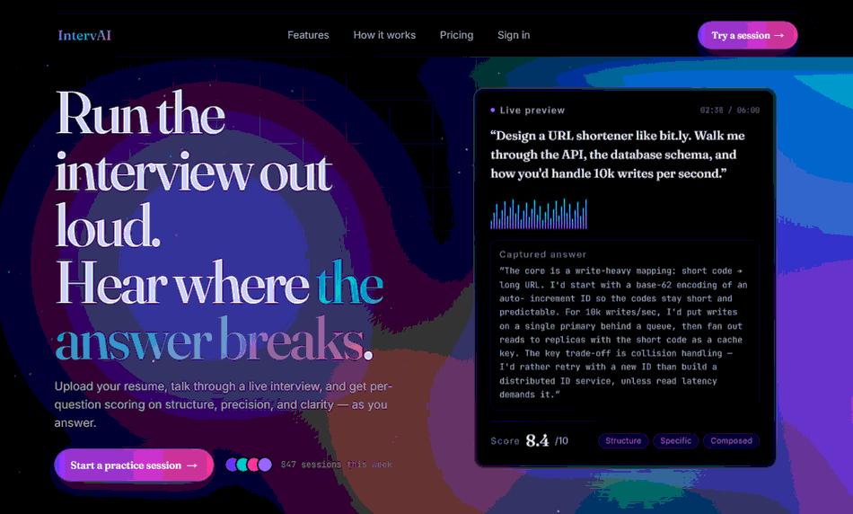
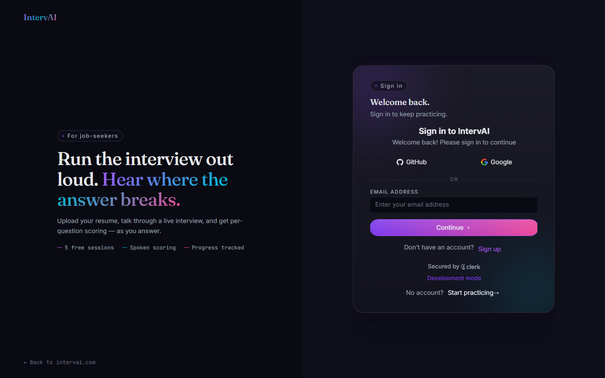
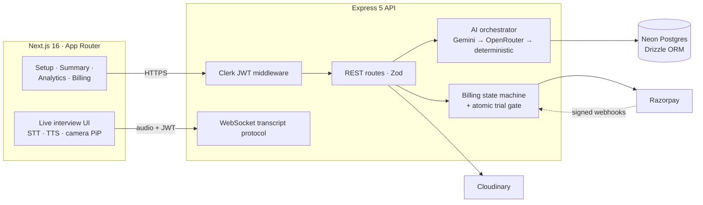

<div align="center">
  

  <h1>IntervAI</h1>

  <p>
    <strong>The AI mock-interview platform that runs the whole interview out loud.</strong>
  </p>

  <p>
    <i>Resume-grounded question plans, live voice answers, per-answer AI scoring, and a coaching report — engineered as a production-grade TypeScript monorepo.</i>
  </p>

  <br/>

  <div>
    
    
    
    
  </div>

  <br/>

  <a href="#-installation--setup">
    
  </a>

  <br/>

</div>

---

## 📑 Table of Contents

- [Project Overview](#-project-overview)
- [Why IntervAI?](#-why-intervai)
- [Screenshots](#-screenshots)
- [Tech Stack](#-tech-stack)
- [Core Features](#-core-features)
- [Architecture & System Flow](#-architecture--system-flow)
- [Security & Reliability Highlights](#-security--reliability-highlights)
- [Installation & Setup](#-installation--setup)
- [Environment Variables](#-environment-variables)
- [Folder Structure](#-folder-structure)
- [Testing & Quality](#-testing--quality)
- [Deployment](#-deployment)
- [Author](#-author)
- [License](#-license)

---

## 📖 Project Overview

**IntervAI** is a full-stack AI mock-interview platform: upload your resume, choose a role, company, difficulty and duration, and an AI interviewer designs a complete question flow — opens conventionally, builds on your actual projects, probes weak answers with follow-ups, and reads every question aloud. You answer by speaking; the system scores each answer on structure, precision and clarity, and closes the session with a personal coaching report.

Built as a strict-TypeScript monorepo — a Next.js 16 App Router frontend talking to an Express 5 API backed by serverless Postgres, with a layered AI pipeline that degrades gracefully instead of failing.

## 🚀 Why IntervAI?

- 🎤 **A real spoken interview, not a quiz form.** Live in-browser speech-to-text with a running waveform, camera picture-in-picture, and text-to-speech so the AI literally asks you the question out loud.
- 🧭 **LLM-designed flow, never random questions.** You pick a duration (15 / 30 / 45 / 60 minutes); the AI plans the whole arc — question count, topic sequence, opening convention and wrap-up — and every question is generated *against that plan*, informed by your resume and an optional job description.
- 🛡️ **Interviews that never die mid-answer.** A primary → fallback → deterministic AI chain guarantees a score for every answer and a report for every session, even during a model outage.
- 🔒 **Freemium economics you can trust.** Trial sessions are metered server-side with race-proof, atomic SQL — no client-side shortcut can mint free interviews, and failed requests are refunded automatically.
- 📊 **Growth you can see.** A personal analytics dashboard with score trends, role and difficulty breakdowns, and practice streaks — turning sessions into a feedback loop.

## 📸 Screenshots

<div align="center">
  
  <br/><i>Landing hero — the live-interview preview with animated waveform and scoring card (auto-plays)</i>
  <br/><br/>
  
  <br/><i>Sign-in — Clerk-backed auth</i>
</div>

## 💻 Tech Stack

### 🎨 Frontend


### ⚙️ Backend


### 🤖 AI & Integrations


## ✨ Core Features

### 🎙 Interview Experience
- 🧾 **Resume-anchored questions** — PDF/DOCX parsed (pdf-parse + mammoth), uploaded to Cloudinary, and distilled by the AI into a candidate profile that grounds every question in *your* projects.
-  **Duration-driven planning** — choose 15–90 minutes; the AI decides how many questions fit that window and sequences the topics.
- 🎧 **Voice-first sessions** — questions read aloud (Web Speech synthesis), answers captured by browser speech recognition with a live transcript + waveform; keyboard input works as a fallback.
- 🪃 **Adaptive follow-ups** — answers are scored the moment they land; shallow answers get probed, exactly like a real interviewer.
- 🏁 **Coaching report** — per-question scores, verdict, strengths, concrete improvements, and a final summary — even if every AI provider is down (deterministic evaluator).

### 📈 Analytics & Monetization
- 📊 **Personal dashboard** — score-trend charts, per-role and per-difficulty averages, weakest-topic signals, and trailing practice streaks.
- 💳 **Freemium billing** — 5 free trial sessions, then Razorpay subscriptions driven by a webhook-based payment state machine (checkout is live in preview mode; collection is not yet enabled).
- ♻️ **Resume dedupe** — byte-identical re-uploads are detected by content hash and reused: no duplicate storage, no re-parsing cost.

### 🛠 Technical Capabilities
- **Typed end to end** — strict-mode TypeScript across both packages, Drizzle-typed schema, and a typed frontend API client.
- **Layered AI orchestration** — one client interface over Gemini → OpenRouter → deterministic scoring; every model response is zod-validated before it touches the database.
- **WebSocket-ready** — an authenticated WS protocol carries the live interview transcript channel alongside the REST API.
- **Consistent error contract** — schema validation on every body/param, JSON-only errors, and a global handler that never leaks stack traces to the browser.

## 🏗 Architecture & System Flow



### 🔄 Request lifecycle
1. **Client action** — the candidate answers a question (or books a plan) in the Next.js UI.
2. **Authenticated dispatch** — every API call carries the Clerk session token; the backend rejects anything anonymous with a JSON `401`.
3. **Rigorous validation** — Zod schemas validate body/params/query *before* any business logic runs.
4. **Business logic & persistence** — Drizzle + Postgres handle writes; trial consumption and refunds are single atomic statements.
5. **AI layer** — question/plan/scoring requests go through the fallback chain; malformed model output degrades to the deterministic evaluator instead of throwing.
6. **Payment truth from webhooks** — Razorpay signature (HMAC, timing-safe) verified against the raw body before any subscription state changes.
7. **UI state update** — the typed client renders scores, progress dots and the coaching report in real time.

## 🛡️ Security & Reliability Highlights

> **Server-side trial enforcement:** the free-trial check and decrement happen in one atomic SQL statement — concurrent requests cannot double-spend, and a failed session creation refunds the trial.<br>
> **Auth on every route:** Clerk JWT verification middleware guards the API; the publishable key is the only Clerk credential that ships to the browser.<br>
> **Webhook integrity:** Razorpay's `X-Razorpay-Signature` is HMAC-verified with `crypto.timingSafeEqual` against the *raw* request body, mounted before any JSON parser can mutate it.<br>
> **Input discipline:** Zod validates every payload; resume uploads are capped at 5 MB, one file, with an explicit MIME allowlist.<br>
> **Strict CORS:** the API only accepts credentialed requests from the configured frontend origin.<br>
> **No leaky errors:** a global Express error handler returns JSON (`500 → "Internal server error"`); stack traces go to server logs, never to the client.<br>
> **Model-outage resilience:** primary → fallback → deterministic scoring ensures a session can always be completed and summarized.<br>
> **Admin override is server-only:** unlimited access via `ADMIN_EMAILS` / DB flag is matched on the backend — no client-side privilege to fake.

## 🚀 Installation & Setup

> **Prerequisites:** Node ≥ 20, npm ≥ 10, and free-tier accounts on the services in [Environment Variables](#-environment-variables).

### 1. Clone the repository
```bash
git clone https://github.com/Krishna-Pratik/IntervAI.git
cd IntervAI
```

### 2. Install dependencies
A single workspace install covers both packages:
```bash
npm install
```

### 3. Configure environments
```bash
cp packages/backend/.env.example packages/backend/.env         # fill in your keys
cp packages/frontend/.env.example packages/frontend/.env.local # Clerk publishable key
```

### 4. Run locally (Turbo runs both packages)
```bash
npm run dev
# → API on http://localhost:4000 · Web on http://localhost:3000
```

Open **http://localhost:3000**, sign in, upload a resume, and interview yourself.

## 🔐 Environment Variables

### Backend (`packages/backend/.env`)
| Variable | Description | Required |
| --- | --- | --- |
| `DATABASE_URL` | Neon (or any) Postgres connection string | ✅ |
| `CLERK_SECRET_KEY` / `CLERK_PUBLISHABLE_KEY` | Clerk auth credentials | ✅ |
| `CLOUDINARY_CLOUD_NAME` / `_API_KEY` / `_API_SECRET` | Resume file storage | ✅ |
| `GEMINI_API_KEY` / `GEMINI_MODEL` | Primary AI (defaults to `gemini-2.5-flash`) | recommended |
| `OPENROUTER_API_KEY` / `OPENROUTER_MODEL` | Fallback AI (free-tier model default) | optional |
| `DEEPGRAM_API_KEY` | Streaming transcription endpoint — the browser's Web Speech API already powers live interviews without it | optional |
| `RAZORPAY_KEY_ID` / `_KEY_SECRET` / `_WEBHOOK_SECRET` | Billing + webhook signing | optional (preview) |
| `RAZORPAY_PLAN_PRO_MONTHLY` / `_YEARLY` | Plan ids, needed once collection is enabled | optional |
| `FREE_TRIAL_LIMIT` | Free sessions per account (default `5`) | optional |
| `ADMIN_EMAILS` | Comma-separated unlimited-access override (server-side) | optional |
| `FRONTEND_URL` / `PORT` / `NODE_ENV` | CORS origin, API port, environment | defaults included |

### Frontend (`packages/frontend/.env.local`)
| Variable | Description |
| --- | --- |
| `NEXT_PUBLIC_CLERK_PUBLISHABLE_KEY` | Clerk browser key (the secret key stays backend-only) |
| `NEXT_PUBLIC_API_URL` | Backend API base — `http://localhost:4000/api/v1` locally |

## 📁 Folder Structure

```text
IntervAI/                              # npm workspaces + Turborepo
├── packages/
│   ├── backend/                       # Express 5 API (TypeScript, strict)
│   │   ├── src/
│   │   │   ├── index.ts               # bootstrap · CORS · WS · error contract
│   │   │   ├── modules/               # route + service per domain
│   │   │   │   ├── interview/         # sessions, plans, questions, summaries
│   │   │   │   ├── resume/            # upload, parse, dedupe (hash-based)
│   │   │   │   ├── analytics/         # trends, breakdowns, streaks
│   │   │   │   ├── billing/           # trial gate + subscription state machine
│   │   │   │   ├── chat/              # WebSocket live-transcript protocol
│   │   │   │   └── webhook/           # Razorpay signature-verified intake
│   │   │   ├── services/
│   │   │   │   ├── ai/                # gemini · openrouter · deterministic fallback chain
│   │   │   │   ├── speech/            # Deepgram integration
│   │   │   │   ├── payments/          # Razorpay + HMAC webhook verification
│   │   │   │   ├── storage/           # Cloudinary
│   │   │   │   └── parser/            # PDF / DOCX extraction
│   │   │   ├── shared/                # config · db · auth + validation middleware
│   │   │   └── db/                    # Drizzle schema + SQL migrations
│   │   └── tests/                     # 40 unit tests (node:test)
│   └── frontend/                      # Next.js 16 App Router
│       └── src/
│           ├── app/                   # landing · interview (setup/live/summary) ·
│           │                          # dashboard · resume · billing · auth pages
│           ├── components/            # Recharts analytics widgets, design tokens
│           └── lib/                   # typed API client, Web Speech hooks
└── package.json                       # turbo pipeline: dev · build · typecheck · db:*
```

## 🧪 Testing & Quality

```bash
# from repo root
npm run typecheck   # strict TypeScript across both packages
npm run lint        # backend ESLint

# backend suite (40 tests)
cd packages/backend && npx tsx --test "tests/**/*.test.ts"
```

- The AI fallback chain, deterministic evaluator, trial-limit access logic and Razorpay webhook signatures are all covered by unit tests.
- Every AI/vendor response is schema-validated before persisting; numeric scores are zod-bounded so malformed model output can never poison the database.
- Trial accounting is race-proof by construction — single atomic statements, verified under concurrent-request scenarios.

## ☁️ Deployment

The platform is built for a modern split deployment (not yet launched — currently run locally):

- **Frontend → Vercel:** import the repo, set root directory to `packages/frontend`, provide the two `NEXT_PUBLIC_*` env vars.
- **Backend → Render:** root `packages/backend`, `npm run build` → `node dist/index.js`, env vars from the table above, and point the Razorpay webhook at `/api/v1/webhooks`.
- **Database:** already serverless (Neon) — connection-pooled, so a long-running or serverless API host both work unchanged.

## 👨‍ Author

**Krishna Pratik**
- GitHub: [@Krishna-Pratik](https://github.com/Krishna-Pratik)
- LinkedIn: [Krishna Pratik](https://www.linkedin.com/in/krishna-pratik)
- Project: [github.com/Krishna-Pratik/IntervAI](https://github.com/Krishna-Pratik/IntervAI)

---

## 📄 License

**PROPRIETARY — ALL RIGHTS RESERVED**

Copyright © IntervAI · Krishna Pratik. All Rights Reserved.

This repository — including all source code, prompts, architecture and documentation — is the exclusive intellectual property of its author. No part of it may be copied, redistributed, modified, used for commercial or non-commercial purposes, or reverse-engineered without explicit written permission.

*The product is provided "AS IS", without warranty of any kind.*
