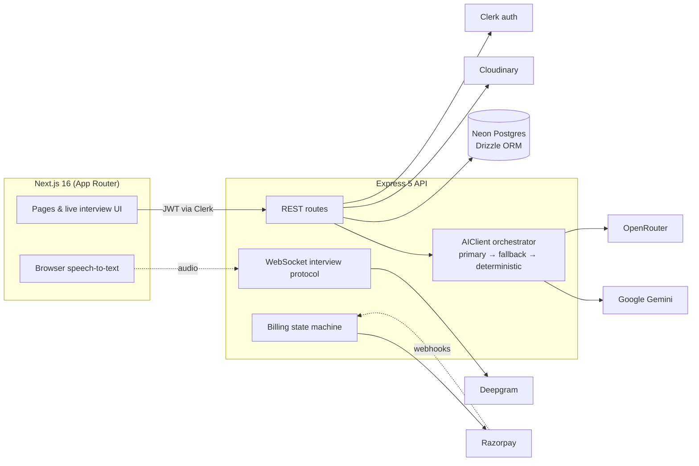

<div align="center">

# 🎙️ IntervAI

**AI-powered mock interviews that talk back.**

Upload a resume. Pick a role, a company, and how many minutes you have.
The AI designs the interview flow, asks it out loud, listens to your
spoken answers, scores every one — and sends you a coaching report.

<br/>


</div>

---

## ✨ Features

| | |
|---|---|
|  **Resume-anchored interviews** | PDF/DOCX parsing + AI profile extraction — questions are grounded in *your* projects and experience, never generic. |
| 🧭 **AI-designed question plans** | Tell it "30 minutes" and optionally paste a job description — the AI plans a full flow: opening convention, topic arc, and a final wrap-up. |
| 🎤 **Real voice interviews** | Live in-browser speech-to-text with a running waveform, camera PiP, and the question read aloud to you. Answer by speaking, not typing. |
| 🪃 **Adaptive follow-ups** | Every answer is scored on the spot; weak answers get probed with a follow-up question, exactly like a real interviewer. |
| 📊 **Coaching report** | End-of-session summary with per-question scores, verdict, strengths, and concrete improvements — plus a personal analytics dashboard (score trends, role & difficulty breakdowns, streaks). |
| 🛡️ **Graceful AI degradation** | Primary → fallback → deterministic scoring chain: the interview never dies because of one model outage, and the report always computes. |
| 🔒 **Strict free-trial enforcement** | Race-proof, server-side trial gate — atomic single-statement consumption, refund-on-failure. No client can skip the meter. |
| 💳 **Freemium-ready billing** | Razorpay subscriptions with webhook-driven state machine (payments currently in preview mode — the checkout experience is live, collection is not yet enabled). |
| ♻️ **Smart resume dedupe** | Byte-identical re-uploads are detected by content hash and reused — no duplicate storage, no re-parsing. |

## 🚀 Quickstart

> **Prerequisites:** Node ≥ 20, npm ≥ 10, and accounts on the services
> below (all have free tiers).

```bash
# 1. Clone & install
git clone https://github.com/Krishna-Pratik/IntervAI.git
cd IntervAI
npm install

# 2. Configure environments
cp packages/backend/.env.example packages/backend/.env       # fill in your keys
cp packages/frontend/.env.example packages/frontend/.env.local # fill in Clerk key

# 3. Run the whole monorepo (API :4000 · web :3000)
npm run dev
```

Open **http://localhost:3000**, sign in, upload a resume, and interview yourself.

<details>
<summary><strong>Environment variables</strong> (backend <code>.env</code>)</summary>

| Variable | Used by | Required |
|---|---|---|
| `DATABASE_URL` | Neon Postgres (Drizzle ORM) | ✅ |
| `CLERK_SECRET_KEY`, `CLERK_PUBLISHABLE_KEY` | Clerk auth | ✅ (secret) |
| `CLOUDINARY_CLOUD_NAME`, `CLOUDINARY_API_KEY`, `CLOUDINARY_API_SECRET` | Resume storage | ✅ |
| `GEMINI_API_KEY` | Primary AI | recommended |
| `OPENROUTER_API_KEY` | Fallback AI | optional |
| `DEEPGRAM_API_KEY` | Streaming transcription endpoint | optional* |
| `RAZORPAY_KEY_ID`, `RAZORPAY_KEY_SECRET`, `RAZORPAY_WEBHOOK_SECRET` | Billing | optional (preview) |
| `ADMIN_EMAILS` | Founder/QA unlimited-access override | optional |
| `FREE_TRIAL_LIMIT` | Sessions per free account (default `5`) | optional |

<small>\* The browser also captures speech natively via the Web Speech API, so live interviews work even before Deepgram is configured.</small>

</details>

### Common scripts (run from repo root)

```bash
npm run dev          # frontend + backend in watch mode
npm run build        # production build via turbo
npm run typecheck    # strict TypeScript across both packages
npm run lint         # backend ESLint
npm run db:studio    # browse the Neon database (Drizzle Studio)
```

Backend tests:

```bash
cd packages/backend && npx tsx --test "tests/**/*.test.ts"   # 40 tests
```

## 🏗 Architecture



**Stack:** Next.js 16 · React 19 · Tailwind · Express 5 · Zod v4 ·
Drizzle ORM · Neon Postgres · Clerk · Google Gemini + OpenRouter ·
Deepgram · Cloudinary · Razorpay · Recharts · Turbo monorepo

## 🗂 Project structure

```
packages/
├── backend/            Express API
│   ├── src/
│   │   ├── modules/    interview · resume · billing · analytics · chat · webhook
│   │   ├── services/   ai/ (fallback chain) · speech/ · payments/ · storage/ · parser/
│   │   ├── shared/     config · db · middleware (auth, validation)
│   │   └── db/         Drizzle schema + migrations
│   └── tests/          40 unit tests (node:test)
└── frontend/           Next.js App Router
    └── src/
        ├── app/        landing · interview (setup/live/summary) · analytics · billing …
        ├── components/ analytics charts (Recharts design tokens)
        └── lib/        typed API client
```

## 🧪 Quality

- **100% TypeScript**, strict mode, zero typecheck errors across the monorepo
- **40 backend tests** covering the AI fallback chain, deterministic
  evaluator, trial-limit access logic, and Razorpay webhook signatures
- Race-proof trial accounting via single atomic SQL statements
  (no double-spend possible under concurrent requests)
- Every external API response is schema-validated before it touches the
  database; malformed AI output degrades instead of crashing

## 🗺 Roadmap

- [ ] Enable live payment collection (plans created + bank connected)
- [ ] Deploy: frontend → Vercel, backend → Render
- [ ] Interview history replay with per-answer audio-free review
- [ ] Role libraries & company-specific interview presets
- [ ] Email coaching digests after sessions

---

<div align="center">

Built end-to-end by [Krishna Pratik](https://github.com/Krishna-Pratik) —
Next.js frontend, Express API, AI pipeline, billing, and analytics included.

**© IntervAI — all rights reserved.**

</div>
